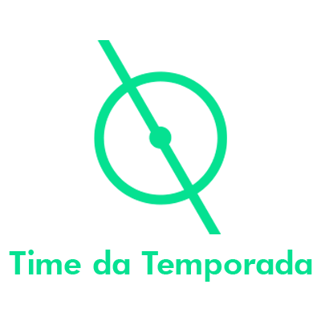
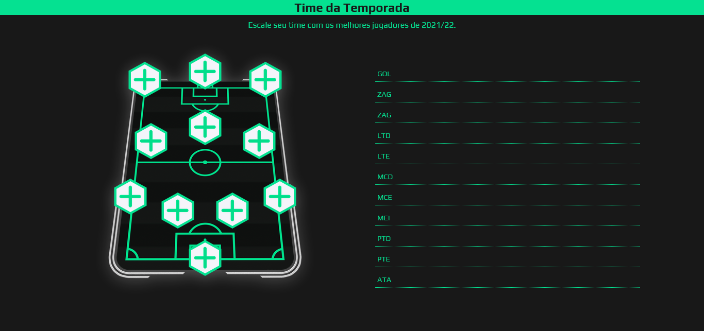

<h1 align="center">
    
</h1>

<h2 align='center'><a href='https://wendellwcl.github.io/TimeDaTemporada-2022/' target='_blank' style='display: block; color: #05E191; font-weight: bold; margin: 30px'>Visitar projeto.</a></h2>

<h2 style='color: #05E191'>Descrição do projeto:</h2>

    Este é um projeto que desenvolvi inspirado em alguns fantasy-games, que são jogos onde os usuários podem escalar suas próprias equipes dentro de um determinado contexto competitivo, geralmente esportes profissionais. Aqui a temática é o futebol, e o objetivo é dar ao usuário a oportunidade de montar o time dos sonhos, com os atletas reais que se destacaram na temporada esportiva de 2021-2022, formando o Time da Temporada. Escale o seu:
    <a href='https://wendellwcl.github.io/TimeDaTemporada-2022/' target='_blank' style='display: block; color: #05E191; font-weight: bold; margin: 30px'>Clique aqui para acessar o projeto.</a>

    

<h2 style='color: #05E191'>Tecnologias utilizadas:</h2>
<ul style='list-style: none; display: flex'>
    <li style='display: flex; flex-direction: column; align-items: center; margin-right: 30px'>
        
        HTML
    </li>
    <li style='display: flex; flex-direction: column; align-items: center; margin-right: 30px'>
        
        CSS
    </li>
    <li style='display: flex; flex-direction: column; align-items: center; margin-right: 30px'>
        
        JavaScript
    </li>
    <li style='display: flex; flex-direction: column; align-items: center; margin-right: 30px'>
        
        Bootstrap
    </li>
    <li style='display: flex; flex-direction: column; align-items: center; margin-right: 30px'>
        
        React
    </li>
</ul>